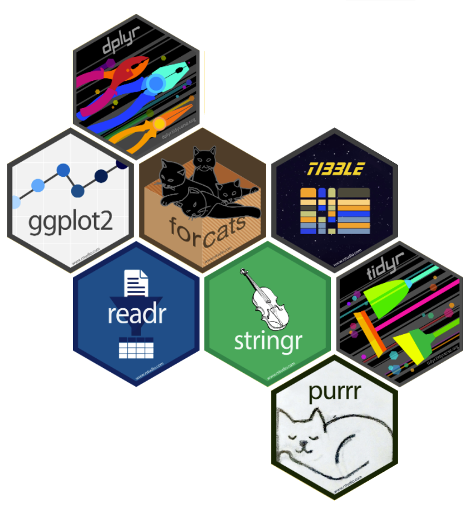
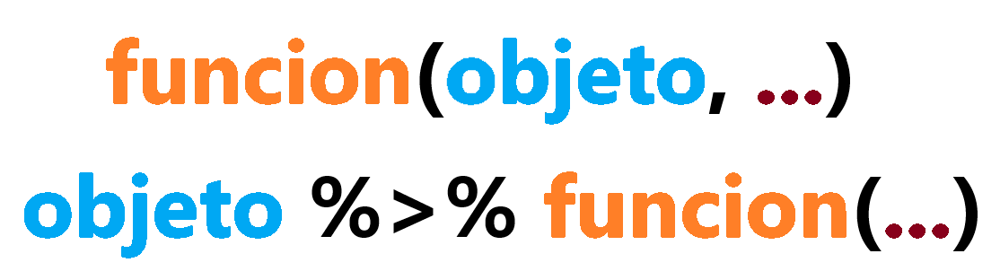

class: left, bottom
background-image: url(media/ds6.jpg)
background-size: cover

.left[]

<br>
<br>


# **`r rmarkdown::metadata$title`**

----
## `r rmarkdown::metadata$subtitle`
### `r rmarkdown::metadata$author`
#### `r rmarkdown::metadata$institute`
###### `r rmarkdown::metadata$date`
<br>
<br>

---
class: left, middle

# Clase 5: Introducción a Tidyverse

----
.pull-left[
.left[

]

* [**Introducción a `tidyverse`**](#tidy)

* [**Sintaxis en `tidyverse`**](#tidy2)

* [**Funciones `dplyr`**](#dplyr)

* [**Estructura de control**](#case_when)

] 

.pull-right[
.left[

]


* [**Actividad 1 `dplyr`**](#act1)

* [**Actividad 2 `dplyr`**](#act1)

.large[**Anexos**]

* [Comando `if`.](#if)
* [Comando `else`.](#else)
* [Comando `ifelse`.](#ifelse)

] 


```{r xaringan-themer, include=FALSE, warning=FALSE}
library(xaringanthemer)

style_mono_light(base_color = "#23395b",
#style_duo(
 # primary_color = "#576675",
 # secondary_color="#f5f5dc", # FF7373
  header_font_google = google_font("Fjalla One"),
  text_font_google   = google_font("Roboto"),
  code_font_google   = google_font("Fira Mono")
)


```

```{r echo=F,warning=FALSE,message=FALSE}
library(tidyverse)
library(skimr)
library(naniar)

set.seed(199)
Base_Ejemplo = tibble("id" = paste(rep(c("A","B","C"),each=3),rep(1:5,3),sep ="-"),
                      "cat"=as.factor(rep(c("A","B","C"),each=5)),
                      "num"=round(runif(15,min=100,max=500),0) )
```

---
name: tiyd

class: inverse, middle, center

# Paquete `tidyverse`
---
# Paquete `tidyverse`
<p>El <code class='bold'>tidyverse</code> es un universo de paquetes para Data Science en R. Algunos de sus paquetes centrales son:</p>

.pull-left[


<div><b>• ggplot2 :</b> Visualización de datos. </div>
</br>
<div><b>• dplyr :</b> Manipulación de datos.</div>
</br>
<div><b>• tidyr :</b> Herramientas para ordenar datos.</div>
</br>
<div><b>• tibble :</b> Reinvención de data frames.</div>
</br>
<div><b>• stringr :</b> Manejo con cadenas de texto (strings).</div>
</br>
<div><b>• readr :</b> Importación de datos.</div>

Y muchos más: **purrr**, **forcats**, **lubridate**, **readxl**, **haven**, etc.

]

.pull-right[

]

---
### Instalación/carga de tidyverse.

<p>En la clase anterior instalamos el paquete <code>tidyverse</code>. Para cargarlo en nuestra sesión tenemos que usar el comando <code>library()</code>. (Si estás usando RStudioCloud tendrán que instalarlo nuevamente):</p>

```{r, eval=FALSE}
install.packages("tidyverse") # Instalar tidyverse

library(tidyverse) # Cargarlo en la sesión
```

Esto carga los ocho paquetes centrales del <code>tidyverse</code>: <code>dplyr, tidyr, tibble, ggplot2, purrr, stringr, forcats, readr</code>. El resto de los paquetes es necesario cargarlos de manera individual.

---
name: tidy2

class: inverse, middle, center

# Sintaxis en Tidyverse

---

# Sintaxis en Tidyverse

<p> La sintaxis del <code class='bold'>tidyverse</code> se ha popularizado en los últimos años porque permite leer el código y programar de forma más parecida a como leemos (de izquierda a derecha y de arriba hacia abajo). Esto es posible gracias al operador "pipe" <code class='bold'>%>%</code> (Ctrl/Cmd + Shift + M), que funciona de la siguiente forma: </p>

.center[]

.pull-left[
<b>Ejemplo R base:</b>
```{r eval = FALSE}
mean(paises[paises$anio == 2007,
            ]$poblacion)
```
]

.pull-right[
<b>Ejemplo <code>tidyverse</code> :</b>
```{r eval = FALSE}
paises %>% 
  filter(anio == 2007) %>% 
  summarize(mean(poblacion))
```
]


---
name: dplyr

class: inverse, middle, center

# Paquete `dplyr` 
---
# Paquete `dplyr` 
.pull-left[
<p> <code class='bold'>dplyr</code> es un paquete enfocado en la manipulación de datos. Es decir, nos permite realizar acciones como seleccionar columnas, filtrar filas, crear y ordenar variables, unir bases de datos, entre otras. </p>
]


.pull-right[

]

.right[
</br>
<h1>Paquete <code>ggplot2</code></h1>
]


.pull-left[
.right[]
]

.pull-right[
<p> <code class='bold'>ggplot2</code> es un paquete que permite la creación de gráficos en R. Es la herramienta de visualización más populr, dadas la gran cantidad de opciones de personalización que ofrece. </p>
]

---
name: dplyr2

class: inverse, middle, center

# Funciones más usadas de `dplyr`

---
# Funciones más usadas de `dplyr`

<code class='bold'>select()</code> : Permite seleccionar variables (columnas).

```{r eval=FALSE}
base %>% 
  select(nombre_variable)
```


<code class='bold'>filter()</code> : Permite filtrar las observaciones de la base dado un criterio definido.

```{r eval=FALSE}
base %>%  
  filter(<Condición asociada a una variable>)
```

<code class='bold'>group_by()</code> : Agrupa filas a partir de categoría de una o más variables.

```{r eval=FALSE}
base %>% 
  group_by(nombre_variable)
```

<code class='bold'>summarise()</code> : Calcula un resumen a base a funciones de R.
```{r eval=FALSE}
base %>% 
  summarise(nombre_calculo = <Función de una variable>, ...)
```

---

<code class='bold'>mutate()</code> : Crea nuevas variables (o modifica las existentes).
```{r eval=FALSE}
base %>% 
  mutate(nueva_variable = <Cálculo en base a una variable>,...)
```


<code class='bold'>rename()</code> : Renombra columnas.
```{r eval=FALSE}
base %>% 
  rename(nuevo_nombre = nombre_variable)
```

<code class='bold'>count()</code> : Cuenta el número de observaciones en cada grupo. 
```{r eval=FALSE}
base %>% 
  count(nombre_variable)
```


<code class='bold'>slice()</code> : Permite extraer observaciones (filas) de acuerdo a su posición.

```{r eval=FALSE}
base %>% 
  slice(vector_de_filas)
```

<code class='bold'>arrange()</code> : Ordena las filas según los valores de una columna.
```{r eval=FALSE}
base %>% 
  arrange(nombre_variable)
```

---
name: case_when

class: inverse, middle, center

# Comando `case_when`

---
name: case_when
# Comando `case_when`

El comando `case_when` de la librería `dplyr`, permite evaluar múltiples `if` e `ifelse` al mismo tiempo. Es el equivalente de la sentencia `CASE WHEN` de SQL. Este funciona de la siguiente forma:

```{r eval=F}
case_when(<Condición 1> ~ <Resultado si condición 1 es TRUE>,
          <Condición 2> ~ <Resultado si condición 2 es TRUE>,
          ...)
```

Es un comando especialmente útil para recodificar variables categóricas. 

**Ejemplo:** Definamos un `case_when()` que nos permita replicar el ejemplo anterior: 

```{r eval=F}
case_when(nota < 1 ~ "Error, ingrese un número entre 1 y 7.",
          nota > 7 ~ "Error, ingrese un número entre 1 y 7.",
          is.numeric(nota) == FALSE ~ "Error, ingrese un número.",
          nota >= 4 ~ "¡Felicitaciones!",
          nota <4 ~ "Reprobaste")
```


---
name: act1

class: inverse, middle, center

# Actividad 1

---

# Actividad 1

<p>La base de datos <code class='blanco'>playstore.xlsx</code> contiene información sobre algunas aplicaciones para dispositivo móvil ofrecidas en la plataforma. Importe la base de datos <code class='blanco'>playstore.xlsx</code> y realice lo siguiente:

<b>1.-</b> Ordene según la variable `Tamaño`

<b>2.-</b> Filtre por las aplicaciones que son *pagadas*

<b>3.-</b> Agregue la variable `Ganancias` definidas como el precio ponderado por la cantidad de descargas

<b>4.-</b> Agrupe por `Categoría`

<b>5.-</b> Obtenga la `Ganancia` promedio por las distintas `Categorías` 


---
name: act2

class: inverse, middle, center

# Actividad 2

---
# Actividad 2 propuesto


<p> Vuelva a utilizar la base de datos <code class='blanco'>viviendasRM.xlsx</code> que contiene avisos de viviendas usadas que se venden en la Región Metropolitana de Chile. El objetivo es replicar la actividad de hace unas clases, pero con la lógica de dplyr, es decir:

Usando funciones de dplyr junto con el operador pipe <code class='blanco'>%>%</code> indique:

<ol type="a">
  <li> Toda la información del cuarto registro. </li>
  </br>
  <li> El número de baños de la vivienda del registro 8. </li>
  </br>
  <li> El numero de estacionamientos de la vivienda 14. </li>
  </br>
  <li> Total de superficie M2 y valor en UF, para las viviendas desde la quinta a la décima. </li>
  </br>
  <li> Listado de superficie M2, corredor y valor en UF de viviendas cuya superficie M2 es igual a 100 m2.</li>
</ol>

---
name: anexo

class: inverse, middle, center

# Anexos
---
# Anexos

<p>En programación, una estructura de control es un tipo de comando que nos permite controlar cuándo se ejecuta nuestro código, mediante sentencias condicionales, las cuales se definen usando operadores lógicos. </p>


<b>Ejemplos de sentencias condicionales:</b>


| Sentencia condicional | Código |
| ------- | ------- |
| Es un número es mayor o igual a 4. | numero >= 4 |
| Es un número par. | numero %% 2 == 0 |
| Nació antes del 1998 | anho_nacimiento < 1998 |
| Tiene educación superior completa. | nivel_edu == "Superior Completa" |

---

# Comando <code>if</code>

<p>El comando <code class="bold">if()</code> se usa para ejecutar un código sólo cuando se cumpla una condición específica. Es equivalente a un si lógico (sí), esto se usa de la siguiente forma: </p>

```{r,eval=FALSE}
if( Condición ){
  Código a ejecutar si la condición es VERDADERA
}
```

--

<p> <b>Ejemplo: </b> Si la calificación de un estudiante es <b>mayor o igual a 4</b>, entonces imprima en la consola un mensaje de felicitaciones.</p>

--

```{r eval=F}
if(nota >= 4){
  print("¡Felicitaciones! :)")
}
```

---
name: else

class: inverse, middle, center

# Comando <code>else</code>

---
# Comando <code>else</code>

<p>El comando <code class="bold">else()</code> se usa para añadir condiciones a un <class="bold">if</code>. Equivale a decir "en otro caso", esto se usa de la siguiente forma: </p>

```{r,eval=FALSE}
if( Condición ){
  Código a ejecutar si la condición es VERDADERA
}else{
  Código a ejecutar si la condición es FALSA
}
```

--

<p><b>Ejemplo:</b> Si la calificación de un estudiante es <b>mayor o igual a 4</b>, imprima un mensaje de felicitaciones. En otro caso, ejecute un mensaje de reprobación.</p>

--
```{r eval=FALSE}
if(nota >= 4){
  print("¡Felicitaciones! :)")
}else{
  print("Reprobaste :(")
}
```

---
name: ifelse

class: inverse, middle, center

# Comando <code>ifelse</code>

---


# Comando <code>ifelse</code>


El comando <code class="bold">ifelse()</code> acorta la escritura anterior, pudiendo escribir un <code class="bold">if()</code> y un <code class="bold">else()</code> con sólo un comando. Este se usa de la siguiente forma:

```{r,eval=FALSE}
ifelse(Condición,
       Código si condición es VERDADERA,
       Código si condición es FALSA)

```


.pull-left[
.center[**Con `if()` y `else()`**]

```{r eval=FALSE}
if(nota >= 4){
  print("¡Felicitaciones!")
}else{
  print("Reprobaste")
}
```
]

.pull-right[

.center[**Con `ifelse()`**]

```{r eval=FALSE}
ifelse(nota >= 4,
       print("¡Felicitaciones!"),
       print("Reprobaste") )
```
]

--

.large[.center[¿Qué pasa si ingresamos una nota negativa o una nota mayor a 7? ¿Tiene sentido, en el primer caso, considerar un error de tipeo como un "reprobado"?] ]

---

name: encadenar
# Encadenar `if` y `else`

<p>Se puede encadenar <code>if()</code> y <code>else()</code> para generar condiciones más robustas, por ejemplo, en el caso anterior se puede añadir una condición que entregue un error si se ingresa un número fuera del rango o un objeto que no sea numérico:</p>

```{r eval=FALSE}
if((nota < 1) | (nota > 7) | (is.numeric(nota) == FALSE)) { 
  print("Error, ingrese un número entre 1 y 7")
}else if (nota >= 4) {
    print("¡Felicitaciones!")
  } else{
    print("Reprobaste")
  }
}

```

<p>Tambien, se puede hacer <code class="bold">ifelse()</code>:</p>

```{r eval=F}
ifelse( (nota < 1) | (nota > 7) | (is.numeric(nota) == FALSE),
       print("Error, ingrese un número entre 1 y 7"),
       ifelse(nota >= 4,
              print("¡Felicitaciones!"),
              print("Reprobaste")))
```


---

name: adiós

## Referencias y material complementario


[**Capítulo sobre visualización de datos del libro "R para Ciencia de Datos"`**](https://es.r4ds.hadley.nz/visualizaci%C3%B3n-de-datos.html), de Hadley Wickham y Garrett Grolemund.

[**Cheatsheet Domar Datos con `dplyr` y `tidyr`**](https://github.com/rstudio/cheatsheets/raw/master/translations/spanish/data-wrangling-cheatsheet_Spanish.pdf), Traducido por Frans van Dunné.

[**Cheatsheet Transformación de Datos con `dplyr`**](https://github.com/rstudio/cheatsheets/raw/master/translations/spanish/data-transformation_Spanish.pdf)

---

name: gracias

class: inverse, center, middle


# ¡Gracias!
<br>
<br>

Diego Muñoz
<br> 
[**dimunoz1@uc.cl**](dimunoz1@uc.cl) 

<br> 
<br> 
Felipe Moya
<br> 
[**felipe.moya@uc.cl**](felipe.moya@uc.cl) 

